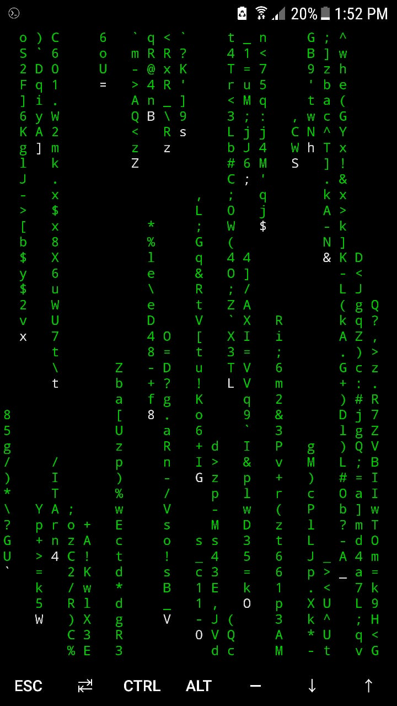

# Termux_commands

## Storage setup, Update and Upgrade Command

- `termux-setup-storage`
- `apt-update`
- `apt upgrade`

## Apt Command
 `apt` is a command-line utility for installing, updating, removing, and otherwise managing deb packages on Ubuntu, Debian, and related Linux distributions. It combines the most frequently used commands from the `apt-get` and `apt-cache` tools with different default values of some options.
 `apt` is designed for interactive use. Prefer using `apt-get` and `apt-cache` in your shell scripts as they are backward compatible between the different versions and have more options and features.
 Most of the `apt` commands must be run as a user with `sudo` privileges.
- Listing all packages: `apt list`
- Installing a package: `apt install` or `pkg install`
  ex: `pkg install zile`,
      `apt install cmatrix`.
  checkout if they have been installed in the list of packages.
  running cmatrix like in the Matrix movie: `cmatrix`
  
  
  - Updating package index (`apt update`)
  - Upgrading packages (`apt upgrade`)
  - Full Upgrading (`apt full-upgrade`)
  The difference between upgrade and full-upgrade is that the later will remove the installed packages if that is needed to upgrade the whole system.
  - Installing packages (`apt install`)
  - Removing Packages (`apt remove`) : apt remove package-name
  - Remove Unused Packages (`apt autoremove`)
  - Searching Packages (`apt search`)
  - Package Information (`apt show`)
  
  Knowing how to manage packages is an essential part of Linux system administration.
 `apt` is a package manager for debian based distributions. To learn more about the `apt` command open your terminal and type `man apt`.
 
 
 ## Package Management Systems
 Most package systems are built around collections of package files. A package file is usually an archive which contains compiled binaries and other resources making up the software, along with installation scripts. Packages also contain valuable metadata, including their dependencies, a list of other packages required to install and run them.
 
|   Operating   | SystemFormat  |      Tools                    |
| ------------- | ------------- | ----------------------------- |
| Debian        | .deb          | apt(apt-cache, apt-get, dpkg) |
| Ubuntu        | .deb          | apt(apt-cache, apt-get, dpkg) |
| CentOS        | .rpm          | yum                           |
| Fedora        | .rpm          | dnf                           |
| FreeBSD       | .txz          | make,pkg                      |
